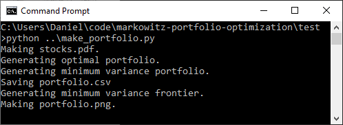
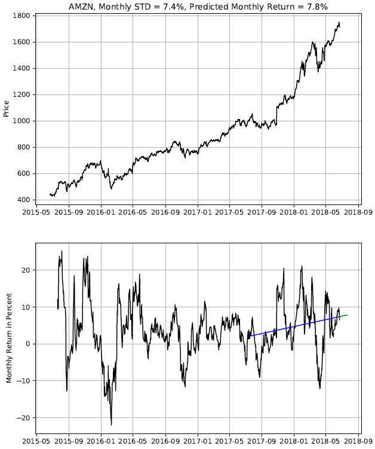
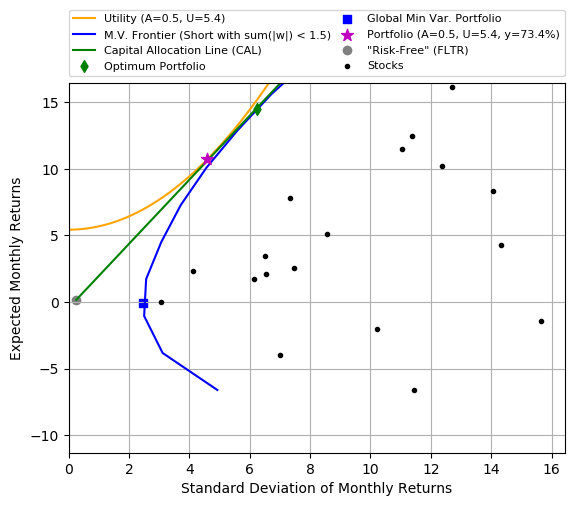
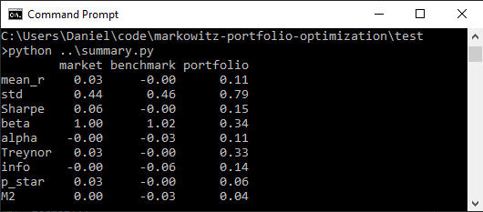
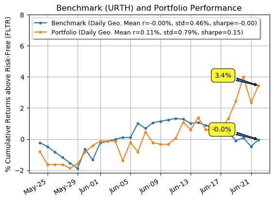

# Markowitz Portfolio Optimization
This program uses the Modern Portfolio Theory (MPT) introduced by [Harry Markowitz](https://en.wikipedia.org/wiki/Harry_Markowitz) in 1952.
MPT is well described in the following two sites; [wiki](https://en.wikipedia.org/wiki/Modern_portfolio_theory) and [Investopedia](https://www.investopedia.com/terms/m/modernportfoliotheory.asp).   

The motivation for this program came from the FINE 6200S "Investments" course as part of the [Schulich School of Business MBA](https://schulich.yorku.ca/programs/mba/) program.
In this course, we had a project to manage a portfolio in the [StockTrak](https://www.stocktrak.com/) stock market simulator.   

The project team was comprised of the following members:
1. [Daniel Fudge](http://www.linkedin.com/in/daniel-fudge)
2. [Gordon Maxeiner](http://linkedin.com/in/gordon-maxeiner-795a7271)
3. [Maher Khatoun](http://linkedin.com/in/maher-khatoun)
4. [Vipul Dudani](http://linkedin.com/in/vipul-dudani) 

Please read the [final report](docs/final_report.pdf) for a detailed description of our overall strategy and results.

## Creating the "_Book_"
Below running any of the code we manually create the _Book_, or the list of stocks that we can select from to build our portfolio.
For each stock in the book, we place a `[name].csv` in the `stocks` sub-folder where the [name] refers to the stock ticker. 
Each csv file needs to contains the "Date" and "Adj Close" columns.  Daily frequency is required. 
This test uses downloads from [Yahoo Finance](http://ca.finance.yahoo.com).
See the `test` folder for an example of the book and execution.

## Defining the Current Position
Before any trades can be recommended we need to download the `OpenPosition.csv` from [StockTrak](https://www.stocktrak.com/) or create it in some other manner.

## Determining What Trades to Make
The first task of this program is to recommend trades.  To execute this for the test case, move into the test directory and type the following command:
```
python ..\make_portfolio.py
```  
Note this is for Windows and without the PATH environment variable setup.  You should see output as shown below.  


Please see the doc-string in `make_portfolio.py` for detailed instructions on the required input.  
This should generate a `portfolio.csv` file that indicates what trades to make. 
An Excel file is also included in the test folder and sometimes used to manually _play_ with the numbers.  

To help visualize the stock histories, stocks.pdf is generated, which shows the following for each stock in the book.  
  

The portfolio is also illustrated with `portfolio.png` shown below.  



## Getting summary of your performance
Once you have made accumulated some trading history, you will want to compare yourself with a benchmark. 
To execute this for the test case, move into the test directory and type the following command:
```
python ..\summary.py
```  
You should see output as shown below.  


Please see the doc-string in `summary.py` for detailed instructions on the required input.  

The portfolio history is illustrated in `summary.png` as shown below.


## License
This code is copyright under the [MIT License](LICENSE).

## Contributions
Please feel free to raise issues against this repo if you have any questions or suggestions for improvement.
